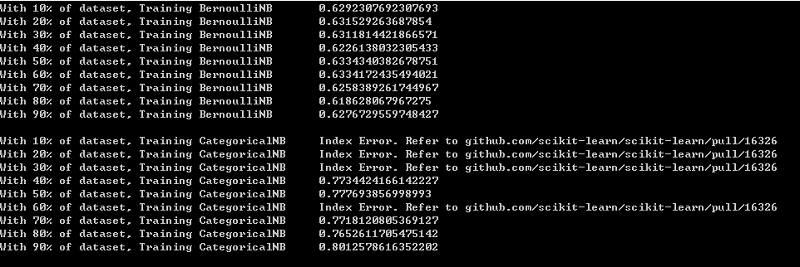
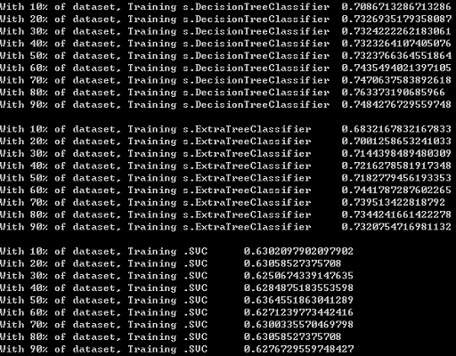
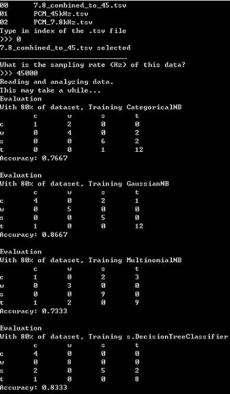
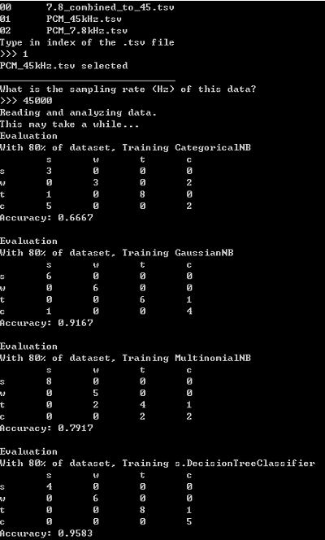
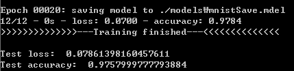
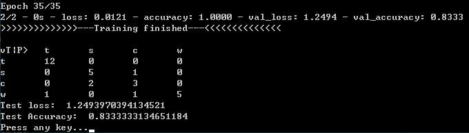
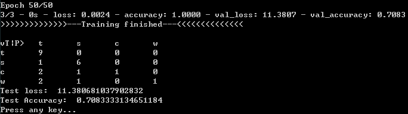
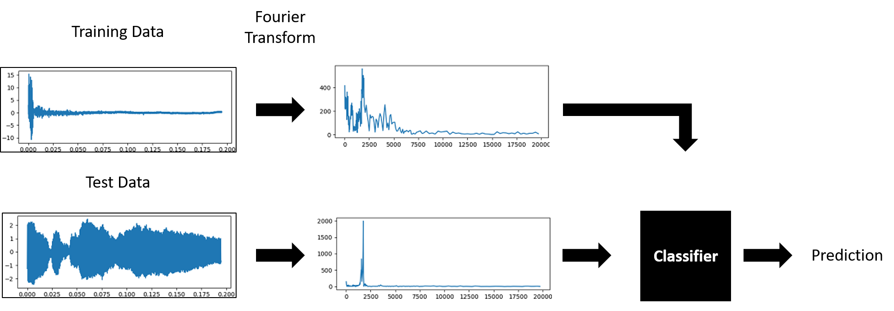
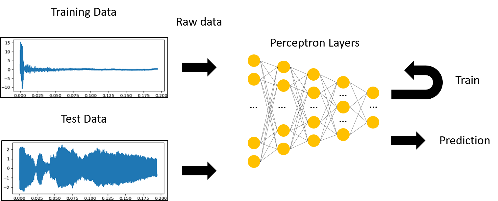

# ML_DL-Exercise
I am trying to understand and compare ML and DL in this project.
### Motivation
On my recent project, [Door Opener](https://github.com/Mins0o/Door_Opener), I used my limited knowledge of machine learning to classify audio signal.  
I wanted to dive deeper into the study of machine learning with this project. After taking a one week crash course at my Univ about DL now I have a better understanding of how it works.  
This is my attempt to get familiar with the subject.
  
For these exercises, I will be doing supervised classifications.  
  
___
## Machine Learning
### Name-Gender Classification
This is how I first encountered the world of machine learning. I took an NLP course last semester and learned about classifiers for the first time. I thought revisiting this example will be perfect as a warm up.
- **Data**  
  For name data, I used the python nltk package's builtin names dataset (`nltk.corpus.names`). 7944 total occuranes, 2943 male, 5001 female.
- (data) **Features**  
  - Last letter: I happen to know the last letter of a name somehow works well as an indicater of gender. 
  - First two letters: This was a random choice I made.
  - Length of the name
  - Number of 'm's it contains
  - Number of double 'l's it contains
  - If the name ends with "ce"
- **Classifiers**  
  Since I didn't know the differences of the classifiers, I tried a bunch of classifiers provided from the sklearn package.
  The categorical NB classifier seem to work well.
  I played around with the features and made about 2% of consistant improvment with the categorial classifier.
- **Result**  
  75% ~ 78% accuracy. (regardless of train-test split)
  
   
**Read more about how to do this experiment with nltk [here](https://www.geeksforgeeks.org/python-gender-identification-by-name-using-nltk/).**

  
### Audio Classification
This is an extension from my last project, the [Door Opener](https://github.com/Mins0o/Door_Opener). Carrying on from the project, I wanted to experience machine learning development process in more extent: Data acquiring, preprocessing, feature extraction and classifier experiments.
- **Data**  
  For this experiment, I used [custom made datasets](https://github.com/Mins0o/PCMLabeler "PCMLabeler Repository"). PCM data of air pressure sampled in 45000 Hz and 7840 Hz.  
  The dataset has about 130 instances with 4 categories of sound waves: tap on mic, finger snap, clap, and whistling.
- **Preprocessing**  
  I was experimenting with the recording settings in the recording project, so the data had different length, sampling rate etc. I trimed/elongated/resampled/interpolated the data to match recordings from several different settings.
- (data) **Features**  
  - Most dominant frequency: Fourier transform was used for frequency spectrum analysis.  
  - Duration: Since whistling had significantly longer duration than other sounds which are basically pulses, I add a feature to measure duration of significant air pressure change.
  - Mid-range most dominant frequency: The pulses were having occasional low-frequency spikes, so I added this as another feature to differentiate them.
- **Classifiers**  
  Categorical, Gaussian, Tree classifiers, and SVC seemed to work well (not in particular order), but the categorical classifier had an [issue with unseen value at training](github.com/scikit-learn/scikit-learn/pull/16326). 
- **Result**  
  The accuracy depends on the random train-test split, but it ranges from 70% ~ 100% (train-test ratio 8-2) at average of about 80%. Considering how small the dataset is, I think the result is pretty decent.
  
___
^For these two experiments (names|PCM), I've constructed a parent class that facilitates their multi feature extractions, dataset manipulation, training and evaluation. The feaures were added to individual experiment classes.
___
## Deep Learning
### Mnist Classification
Similar to the name-gender classification in the traditional ML category, this was my first encounter to the deep neural network.
- **Data**  
  Dataset is consisted of handwriting-number match of Arabian numeral (0 ~ 9). It has 60,000 occurancies for training and 10,000 for testing.  
- **Network**  
  I used a rather simple network with two hidden layers with 512 and 200 output each. The input data of 28 x 28  pixel image is fed into the first layer as a string of 784 pixels. I added dropout of 0.2 for each hidden layers.  
  Activation function for the hidden layers are RELU and the output layer is softmax.
- (software) **Extra Features**  
  Saving, loading the model for later use without having to train it.
- **Result**  
  98% accuracy.  
  

### Audio Classification
- **Data**  
  Data used in this experiment was exactly same as the PCM classification with traditional ML: PCM recordings I created.  
  The PCM data was normalized to be within -1 to 1
- **Network**  
  I have no rational backing to my decision, but thinking that deeper network might work better on more complicated feature recognition (Fourier?), I used deeper and wider neural network for this experiment.
- **Result**  
  
I can't say this in certainty, but the lack of data seemed to cause problem when trying to fit the data. validation accuracy could go up to 83 % for 30 ~ 40 epochs but would go down to 58 % when fitted over 100 epochs.  
Finding a hyper-parameter set to produce decent result was very tricky to do. The result presented here is work of a lot of luck. Real average of accuracy is close to 70 % ~ 75 %
___
^For both cases, I didn't work on any feature extraction and put in it's raw data.
## ML and DL result comparison  
data_1: 7840 Hz (sampling rate) data interpolated to 45000 Hz (sampling rate).  
data_2: only 45000 Hz data.
For all experiments, the train-test split was 80%.
**Type** | ML |  |DL |  |  
---|---|---|---|---|  
Data|data_1 | data_2 | data_1 | data_2 |  
Accuracy (%) |86.67 | 95.83 | 76.67 | 70.83 |
- I didn't have to be so creative to get results from DL like in ML. For ML feature extract for PCM, I learned a whole new concept and implementation of descrete Fourier trasform. But I also felt a strong down side of DL: without much data, it isn't that powerful enough.
  
